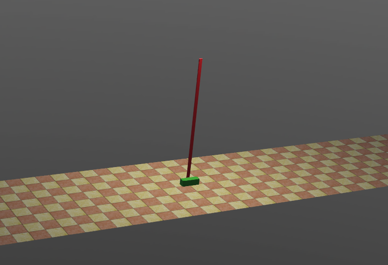

# LQR算法仿真

* 仿真环境：Webots
* 被控对象：基于官方示例修改的倒立摆模型
* 控制算法：LQR
* 参数仿真及计算平台：MATLAB

## 说明

LQR是一种最优化控制的方法，相比于PID，LQR需要对被控系统进行精确的建模，这是LQR在实际应用中最大的难点，但是系统的模型建立好后，可以根据对系统动态相应的要求直接计算出对应的参数，而不是像使用PID时一样靠经验调试，系统的动态相应可以在MATLAB中仿真。

下图是在Webots中使用LQR算法控制倒立摆的效果，系统模型的分析在matlab仿真文件夹中做近一步说明

    

