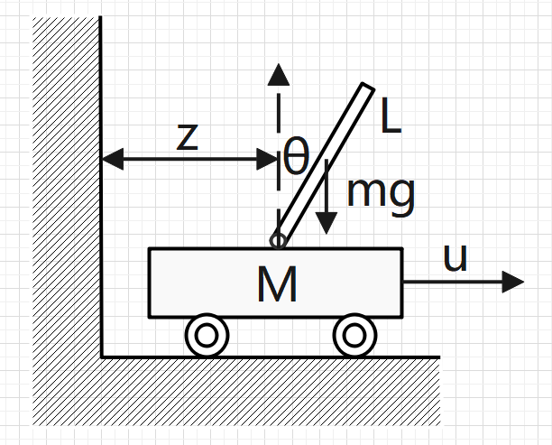

# 倒立摆模型

这次仿真的是如下模型，为了验证LQR算法的实际效果

## 小车倒立摆模型

    

如上图所示，质量为M的小车上有一个长度为L，质量m的均质杆，杆与地面法线的夹角为$\theta$，杆可绕一点自由旋转，杆的旋转中心水平坐标为z，小车的控制量为u，忽略所有摩擦

由上述情况可以建立系统的模型，x，y分别表示杆中心的x,y坐标，将杆旋转重心的高度设为0，设$l = \frac{1}{2}L$
$$
x = z + lsin\theta \Rightarrow \ddot x = \ddot z - lsin\theta \dot\theta^2 + lcos\theta \ddot\theta \tag{1}
$$

$$
y = lcos\theta \Rightarrow \ddot y = -lcos\theta \dot\theta^2 - lsin\theta \ddot\theta \tag{2}
$$

对于杆，竖直方向受到重力mg和小车对它的支持力$F_y$
$$
mg - F_y = -m\ddot y \Rightarrow F_y = mg - ml(cos\theta \dot\theta^2 + sin\theta \ddot\theta) \tag{3}
$$
水平方向
$$
F_x = m\ddot x \Rightarrow F_x = m(\ddot z - lsin\theta \dot\theta^2 + lcos\theta \ddot\theta) \tag{4}
$$

对于小车，竖直方向自身的重力和杆对小车的压力与地面支持力平衡，水平方向受控制量u和$F_x$的反向力
$$
u - F_x = M\ddot z \tag{2-5}
$$

将（4）代入（5）式

$$
\Rightarrow (M + m)\ddot z = u + mlsin\theta \dot\theta^2 - mlcos\theta \ddot\theta \tag{6}
$$

对杆的旋转分析，因为$J\beta = M$，其中J为转动惯量，$\beta$为角加速度，M为扭转力矩
$$
J\ddot \theta = F_ylsin\theta - F_xlcos\theta \tag{7}
$$
将式（3）和式（4）代入式（7）
$$
J\ddot \theta = l(mgsin\theta - ml(cos\theta \dot\theta^2 + sin\theta \ddot\theta)sin\theta - 
m(\ddot z - lsin\theta \dot\theta^2 + lcos\theta \ddot\theta)cos\theta)
$$

$$
\Rightarrow (J + ml^2)\ddot\theta = mglsin\theta - ml cos\theta \ddot z \tag{8}
$$

当$\theta \to 0$时，$sin\theta = \theta,cos\theta = 1$，式（8）可以线性化
$$
(J + ml^2)\ddot\theta = mgl\theta - ml\ddot z \tag{9}
$$
式（6）线性化，舍去带有$\dot\theta^2$的高阶项
$$
(M + m)\ddot z = u - ml\ddot\theta \tag{10}
$$
式（9）和（10）化简得
$$
\ddot z = \frac{-m^2l^2g\theta + (J + ml^2)u}{J(M + m) + Mml^2}
$$

$$
\ddot \theta = \frac{(M + m)mgl\theta - mlu}{J(M + m) + Mml^2}
$$

所以得到系统的状态空间方程
$$
\dot x = 
\begin{bmatrix}
\dot z \\
\ddot z \\
\dot \theta \\
\ddot \theta 
\end{bmatrix} =
\begin{bmatrix}
0 & 1 & 0 & 0 \\
0 & 0 & \frac{-m^2l^2g}{J(M + m) + Mml^2} & 0 \\
0 & 0 & 0 & 1 \\
0 & 0 & \frac{(M + m)mgl}{J(M + m) + Mml^2} & 0
\end{bmatrix}
\begin{bmatrix}
z \\
\dot z \\
\theta \\
\dot\theta
\end{bmatrix} +
\begin{bmatrix}
0 \\
\frac{J + ml^2}{J(M + m) + Mml^2} \\
0 \\
\frac{-ml}{J(M + m) + Mml^2}
\end{bmatrix}u
$$
均质杆绕中心点转动，转动惯量为
$$
J = \frac{1}{12}mL^2
$$

## 注意

MATLAB计算出的参数大部分可能在Webots中都不能取得很好的效果，因为计算的模型经过了简化和线性化，且没有考虑最大控制量等问题，计算出的参数可能并不能使Webots中的系统稳定，实际仿真过程也需要一个调参的过程，不过这个过程比PID要容易些。